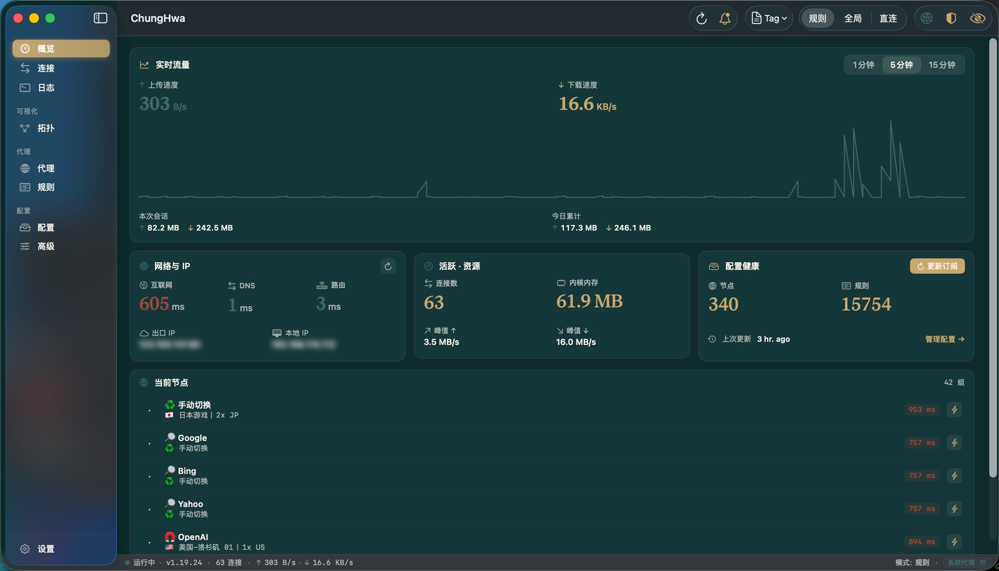

# 中華 · ChungHwa

macOS 上的 [mihomo](https://github.com/MetaCubeX/mihomo) 原生客户端。

> [English](./README.md)



## 为什么有这玩意

我喜欢 [ClashMac](https://github.com/666OS/ClashMac) 的 UI。我想要
[Clash Verge Rev](https://github.com/clash-verge-rev/clash-verge-rev)
的性能。某个上午 ClashMac 决定一小时崩 14 次后，ChungHwa 出生了。

## 状态

自用。Apple Silicon，新点的 macOS。未签名、未公证——克隆、编译、跑。
从 Releases 拿到的 DMG 第一次开如果 Gatekeeper 不让：

```sh
xattr -dr com.apple.quarantine /Applications/ChungHwa.app
```

## 里面都有啥

- **十二屏**，但大部分时候你只会用菜单栏那个图标
- **一个叫「Bone & Brass on Patina」的主题**，每个项目都该有个矫情
  名字
- **实时一切**——流量曲线、连接、日志、每行连接旁的 GeoIP 国旗，全
  在流式刷
- **TUN 真能用**——输一次密码，从此透明接管路由
- **DNS、自定义路由、入站端口、代理认证**——都能在 UI 里改，不用碰
  yaml
- **跨内核重启不丢**——节点延迟、GeoIP 缓存、24 h 流量历史都进
  SQLite
- **自定义路由不挑订阅**——splice 在源 yaml 的 rules 之上，永远先
  匹配
- **菜单栏快捷开关**——系统代理 / TUN / 匿名模式 / 模式切换 / 组→节点
  全在一键内
- **`⌘1`–`⌘9`** 切 tab、`⌘R` 重载、`⇧⌘R` 重启内核、`⌘K` 聚焦搜索、
  `⇧⌘K` 清空日志

## 编译

Xcode 打开 `ChungHwa.xcodeproj`，`⌘R`。第一次编译会拉 mihomo 到
`Vendor/mihomo/`（gitignored）并嵌进 .app。

打 DMG：

```sh
./scripts/make-dmg.sh           # 自动版本
./scripts/make-dmg.sh 1.2.3     # 指定版本
```

产物在 `build/`。CI 在打 tag 时跑同一个脚本（见
`.github/workflows/release.yml`）。

## 首次运行

1. 启动——内核拉起来，菜单栏亮起来，自带一份能跑的 DIRECT 兜底配置
2. **配置** tab——拖个 `config.yaml` 进去或粘订阅 URL
3. toolbar **系统代理** chip。浏览器流量进 mihomo
4. 要 TUN？**设置 → TUN 与权限 → 授权**。一次密码，把内核二进制
   setuid root，从此 TUN 透明接管一切

## 致谢

- [mihomo](https://github.com/MetaCubeX/mihomo) — 真正干活的内核
- [ClashMac](https://github.com/666OS/ClashMac) — UI 灵感
- [Clash Verge Rev](https://github.com/clash-verge-rev/clash-verge-rev) —
  这个 app 一直在追的性能基线

## 许可证

GPL v3，详见 [`LICENSE`](./LICENSE)。
